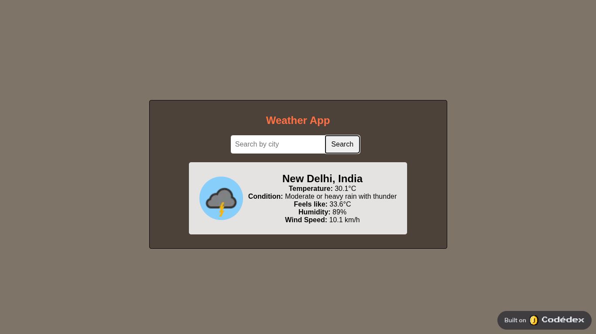

# 🌦️ Weather App

A responsive weather web app built with **HTML, CSS, and JavaScript**. It fetches and displays real-time weather data using the [WeatherAPI.com](https://www.weatherapi.com/) API. Great for beginners learning how to work with APIs and DOM manipulation!

## 📸 Demo

🚀 [Live Demo](https://www.codedex.io/68pgEVgKw7iOgLcd6IBQ/live)



## ✨ Features

- 🔍 Search for weather by city name  
- 🌡️ Current and "feels like" temperature  
- 🌥️ Weather condition with dynamic icon  
- 💧 Humidity display  
- 🌬️ Wind speed in km/h  
- ❌ Error handling for invalid/empty input  
- 🎨 Clean, modern, responsive UI

## 🛠️ Technologies Used

- **HTML5** — Structure & layout  
- **CSS3** — Styling and Flexbox responsiveness  
- **JavaScript (ES6)** — API fetch & DOM interaction  
- **[WeatherAPI.com](https://www.weatherapi.com/)** — Weather data provider

## 🔑 Setup Instructions

### 1. Clone the Repository

```bash
git clone https://github.com/sleeplessarbaj/weather-app.git
cd weather-app
```

2. Get Your API Key  
Sign up at [WeatherAPI](https://www.weatherapi.com/) and get your free API key.

3. Add Your API Key  
In `script.js`, replace:

```js
const apiKey = "Api Key";

const apiKey = "your_actual_api_key";

📁 Project Structure

weather-app/
├── index.html         # Main HTML file
├── styles.css         # Styling
├── script.js          # JavaScript logic
├── assets/
│   └── preview.png    # Project screenshot for README
└── README.md          # Project documentation
